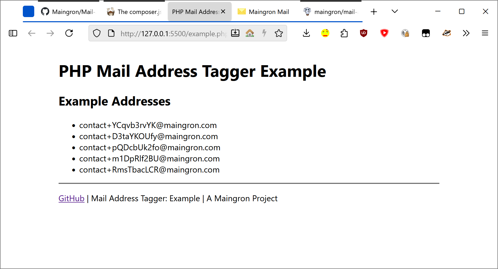

# PHP Mail Address Tagger
## About
You can add this to your PHP project to display a different Email address to each user. Maybe your Email Address is contact@maingron.com, you can then generate contact+random4837423@maingron.com, for example. You can change stuff in the config.

<picture>
  <source srcset="screenshots/screenshot-1.png" media="(prefers-color-scheme: dark)">
  
</picture>

## Installation


### Using Composer

Install via Composer:

```bash
composer require maingron/mail-address-tagger
```

## Links
- [GitHub Repo](https://github.com/Maingron/PHP-Mail-Address-Tagger/)

## Other / Compatibility
### Services working with tagged Email Addresses
I'm aware of Gmail and Mailcow working with tagged Email Addresses. There are probably many more.
